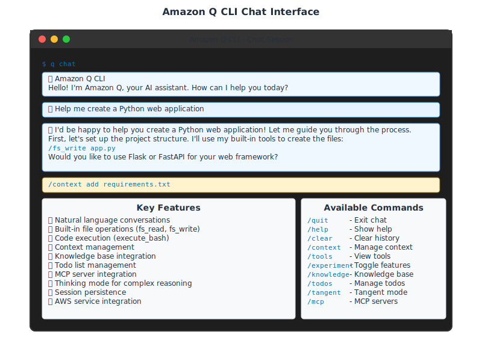

# Chat Interface

## Interactive AI Conversations

The chat interface is Amazon Q CLI's primary feature for interactive AI assistance. Start conversations, get help, and manage your development workflow.

## Chat Interface Overview



## Starting a Chat Session

```bash
# Basic chat
q chat

# Start with a question
q chat "Help me create a Python web application"

# Resume previous conversation
q chat --resume

# Use specific agent
q chat --agent my-agent
```

## Chat Commands

### Context Management
- `/context add` - Add context rules (filenames or glob patterns)
- `/context show` - Display context rules and matched files
- `/context remove` - Remove specified rules
- `/context clear` - Remove all rules

### Tool Access
- `/tools` - List available tools

### Session Management
- `/quit` - Exit chat
- `/clear` - Clear conversation
- `/help` - Show commands

## Best Practices

### Effective Prompting
```bash
# Be specific about your needs
"Help me optimize this Python function for performance"

# Provide context
"I'm building a REST API with FastAPI, help me add authentication"
```

### Using Context
```bash
/context add requirements.txt
/context add main.py
"Explain this project structure and suggest improvements"
```

## Next Steps
Continue to [Built-in Tools](./06-builtin-tools.md) to explore file operations and system integration.
