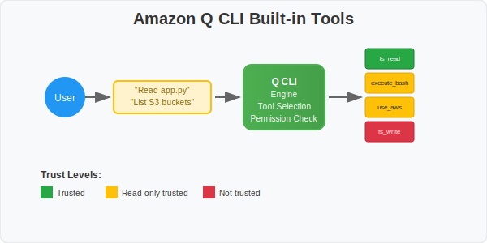
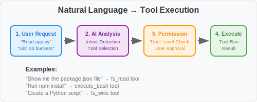
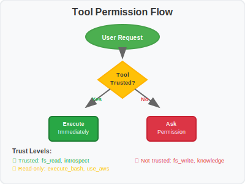

# Built-in Tools

## Overview

Amazon Q CLI includes built-in tools that work through natural language requests, not direct commands. These tools provide seamless integration with your development workflow.



## 🛠️ Available Built-in Tools

| Tool | Trust Level | Description |
|------|-------------|-------------|
| **execute_bash** | 🟡 Trusts read-only | Execute shell commands |
| **fs_read** | 🟢 Trusted | Read files, directories, and images |
| **fs_write** | 🔴 Not trusted | Create and edit files |
| **use_aws** | 🟡 Trusts read-only | Make AWS CLI API calls |
| **thinking** | 🟢 Trusted (experimental) | Shows AI reasoning process for complex problems |
| **introspect** | 🟢 Trusted | Provides Q CLI capabilities and documentation info |
| **report_issue** | 🟢 Trusted | Open GitHub issue template |

**Note**: Additional tools like `knowledge` are covered in dedicated workshop modules.

## 💬 How Tools Work

### Natural Language Interface



Instead of direct tool commands, use conversational requests that automatically trigger the appropriate tools:

```bash
# 📁 File Operations (triggers fs_read/fs_write)
"Read the contents of app.py"
"Create a new Python file with a Flask app"
"Show me the project structure"

# ⚡ Command Execution (triggers execute_bash)
"Run the tests and show me the results"
"Check git status"
"Install npm dependencies"

# ☁️ AWS Operations (triggers use_aws)
"List my S3 buckets"
"Show EC2 instances in us-east-1"
"Create a new Lambda function"

# 🧠 Complex Reasoning (triggers thinking tool)
"Help me design a scalable architecture for my web app"
"Debug this complex error and suggest multiple solutions"
"Plan a migration strategy from monolith to microservices"
"Use thinking tool to analyze this problem step by step"

# 🔍 Q CLI Questions (triggers introspect tool)
"What commands are available in Q CLI?"
"How do I save conversations?"
"What can you help me with?"
"Use introspect tool to show me your capabilities"

```

### Explicit Tool Requests

You can also explicitly request specific tools:

```bash
# Direct tool invocation
"Use thinking tool to solve this problem"
"Use introspect tool to explain your features"
"Use fs_read tool to show me the file"
"Use execute_bash tool to run this command"
"Use use_aws tool to list my resources"
```

### Tool Auto-Activation

Tools are automatically selected based on your request:

| Request Type | Tool Triggered | Example |
|--------------|----------------|---------|
| File reading | `fs_read` | "Show me package.json" |
| File creation | `fs_write` | "Create a README file" |
| Shell commands | `execute_bash` | "Run npm test" |
| AWS operations | `use_aws` | "List my EC2 instances" |
| Complex problems | `thinking` | "Design a database schema" |
| Q CLI questions | `introspect` | "What features do you have?" |

## 🔐 Tool Permissions

### Permission Categories

**🟢 Trusted Tools** (No permission required)
- `fs_read` - Read files and directories
- `introspect` - Answer questions about Q CLI capabilities  
- `report_issue` - Create GitHub issues
- `thinking` - Show AI reasoning process (experimental)*

**🟡 Read-Only Trusted** (Trusts safe operations)
- `execute_bash` - Shell commands like `ls`, `git status`
- `use_aws` - AWS read operations like listing resources

**🔴 Not Trusted** (Always asks permission)
- `fs_write` - Create or modify files

**Note**: Tools marked with * depend on user configuration:
- `thinking` - Enable with `/experiment` or `q settings chat.enableThinking true`

### Interactive Permission Flow



When you request an operation:
1. **Q analyzes** your request
2. **Selects appropriate** tool
3. **Checks permissions** based on trust level
4. **Executes or asks** for permission

## 🔧 Managing Tool Permissions

### `/tools` Command Options

In chat session, you can manage tool permissions:

```bash
# View all tools and their current permissions
/tools

# Show input schema for all available tools
/tools schema

# Trust specific tools for the session
/tools trust fs_write
/tools trust execute_bash

# Remove trust from specific tools
/tools untrust fs_write

# Trust all tools (no confirmations)
/tools trust-all

# Reset all tools to default permission levels
/tools reset

# Get help with tools command
/tools help
```

### Tool Configuration

For permanent tool configuration, you can use agent configurations:
- **Documentation**: [Agent Format Guide](https://github.com/aws/amazon-q-developer-cli/blob/main/docs/agent-format.md#tools-field)
- **Location**: `.amazonq/cli-agents/` (local) or `~/.aws/amazonq/cli-agents/` (global)

## ☁️ AWS Integration with use_aws Tool

### Read-Only Operations (Trusted)
```bash
# ✅ These run without permission
"List my S3 buckets"
"Show EC2 instances in us-east-1" 
"Describe my Lambda functions"
"Get CloudFormation stack status"
"Check RDS instances"
```

### Write Operations (Require Permission)
```bash
# ⚠️ These will ask for permission
"Create a new S3 bucket"
"Launch an EC2 instance"
"Deploy a Lambda function"
"Update security group rules"
```

## 🎯 Best Practices

### ✅ Effective Tool Usage
- **Be specific** with file paths and commands
- **Provide context** about what you're trying to achieve
- **Review permissions** before allowing tool execution
- **Use descriptive requests** for better tool selection

### 🔒 Security Considerations
- **Review commands** before execution
- **Limit tool permissions** in production environments
- **Use agent configurations** to control tool access
- **Monitor tool usage** for security compliance

## 🚀 Try It Yourself

**Interactive Exercise**: Start a chat session and try these requests:

```bash
q chat
```

Then try:
1. `"Show me the current directory contents"`
2. `"Read the README.md file"`
3. `"List my AWS regions"`
4. `"Create a simple Python hello world script"`

## 📚 Next Steps

**Advanced Tool Configuration**: For detailed tool configuration options, JSON settings, and agent configurations, see the official documentation:
- **[Built-in Tools Documentation](https://github.com/aws/amazon-q-developer-cli/blob/main/docs/built-in-tools.md)** - Complete configuration reference

**Workshop Modules**: Some tools have extended capabilities covered in later modules:
- **Knowledge Management** → [Module 7](../advanced-features/07-knowledge-management.md)
- **AWS Advanced Usage** → Coming in advanced modules
- **Custom Tool Configuration** → [Module 8](../advanced-features/08-mcp-integration.md)

Continue to [Advanced Features](../advanced-features/07-knowledge-management.md) to learn about knowledge management and productivity features.
