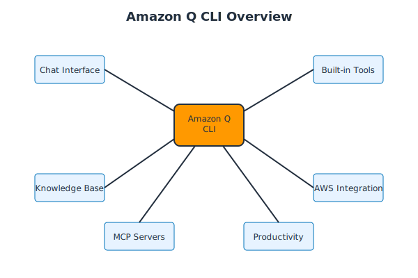

# Introduction to Amazon Q CLI

## What is Amazon Q CLI?

Amazon Q CLI is an AI-powered command-line interface that brings intelligent assistance directly to your terminal. It combines the power of generative AI with deep AWS integration to help developers be more productive.

## Key Features

### 🤖 AI-Powered Assistance
- Natural language conversations about code and AWS
- Context-aware responses based on your project
- Intelligent code generation and debugging

### ⚡ Built-in Tools
- File system operations (`fs_read`, `fs_write`)
- Bash command execution
- AWS CLI integration
- Knowledge base management

### 🔧 Extensibility
- Model Context Protocol (MCP) support
- Custom tool integration
- Plugin ecosystem

### 🎯 Developer-Focused
- Code analysis and optimization
- Infrastructure as Code support
- Best practices guidance

## Why Use Amazon Q CLI?

### Productivity Benefits
- **Faster Development**: Get instant help without leaving your terminal
- **Learning Accelerator**: Understand AWS services and best practices
- **Error Resolution**: Debug issues with AI assistance
- **Code Quality**: Automated reviews and suggestions

### Integration Advantages
- **Seamless AWS Workflow**: Direct integration with AWS services
- **Local Development**: Works with your existing tools and projects
- **Context Awareness**: Understands your project structure and needs

## Use Cases

### For Developers
- Code generation and refactoring
- Debugging and troubleshooting
- Learning new technologies
- API documentation and examples

### For DevOps Engineers
- Infrastructure automation
- AWS resource management
- Configuration optimization
- Monitoring and alerting setup

### For Solutions Architects
- Architecture design guidance
- Service selection recommendations
- Cost optimization strategies
- Security best practices

## Getting Started

Ready to dive in? Let's start with [installation](./02-installation.md) to get Amazon Q CLI running on your system.

## Next Steps

1. [Install Amazon Q CLI](./02-installation.md)
2. [Set up authentication](./03-authentication.md)
3. [Learn basic commands](./04-basic-commands.md)

---

**Estimated Time:** 10 minutes  
**Prerequisites:** Basic command-line knowledge
