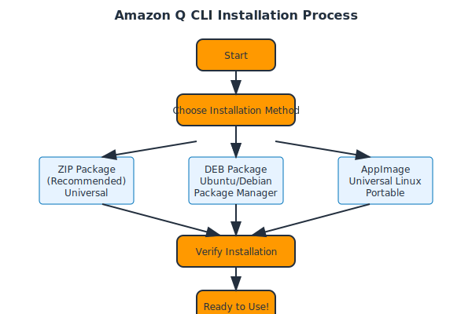

# Installation

## System Requirements

- **Linux** (Ubuntu, Debian, or other distributions)
- **Terminal access**
- **Internet connection** for download

## Installation Methods

### Method 1: ZIP Package (Recommended)

First, check your glibc version to determine which package to download:
```bash
ldd --version
```

**For glibc 2.34+ (standard version):**

Linux x86-64:
```bash
curl --proto '=https' --tlsv1.2 -sSf "https://desktop-release.q.us-east-1.amazonaws.com/latest/q-x86_64-linux.zip" -o "q.zip"
```

Linux ARM (aarch64):
```bash
curl --proto '=https' --tlsv1.2 -sSf "https://desktop-release.q.us-east-1.amazonaws.com/latest/q-aarch64-linux.zip" -o "q.zip"
```

**For glibc <2.34 (musl version):**

Linux x86-64 with musl:
```bash
curl --proto '=https' --tlsv1.2 -sSf "https://desktop-release.q.us-east-1.amazonaws.com/latest/q-x86_64-linux-musl.zip" -o "q.zip"
```

Linux ARM (aarch64) with musl:
```bash
curl --proto '=https' --tlsv1.2 -sSf "https://desktop-release.q.us-east-1.amazonaws.com/latest/q-aarch64-linux-musl.zip" -o "q.zip"
```

**Install the package:**
```bash
# Extract the package
unzip q.zip

# Run the installer (installs to ~/.local/bin by default)
./q/install.sh

# Verify installation
q --version
```

### Method 2: DEB Package (Ubuntu/Debian)

```bash
# Download DEB package
wget https://desktop-release.q.us-east-1.amazonaws.com/latest/amazon-q.deb

# Install using dpkg
sudo dpkg -i amazon-q.deb

# Fix dependencies if needed
sudo apt-get install -f

# Verify installation
q --version
```

### Method 3: AppImage (Universal Linux)

```bash
# Download AppImage
curl -L -o amazon-q.appimage https://desktop-release.q.us-east-1.amazonaws.com/latest/amazon-q.appimage

# Make executable
chmod +x amazon-q.appimage

# Run directly or move to PATH
sudo mv amazon-q.appimage /usr/local/bin/q

# Verify installation
q --version
```

## Installation Diagram



## Verification

After installation, verify Q CLI is working:

```bash
# Check version
q --version

# Test basic functionality
q --help

# Check system diagnostics
q doctor
```

## Troubleshooting

### Command Not Found
```bash
# Check if Q CLI is in PATH
echo $PATH

# Add to PATH if needed
export PATH=$PATH:/usr/local/bin

# Make permanent
echo 'export PATH=$PATH:/usr/local/bin' >> ~/.bashrc
source ~/.bashrc
```

### Permission Issues
```bash
# Fix permissions
chmod +x /usr/local/bin/q

# Check file permissions
ls -la /usr/local/bin/q
```

## Next Steps

Continue to [Authentication](./03-authentication.md) to set up your AWS credentials.
