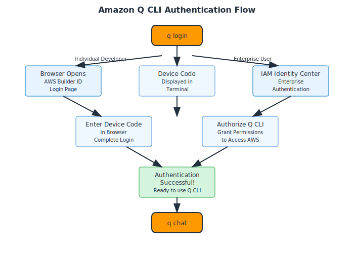

# Authentication Setup

## Overview

Amazon Q CLI requires authentication to access AWS services and AI capabilities. You can authenticate using AWS Builder ID (recommended for individual developers) or IAM Identity Center.



## AWS Builder ID Authentication (Recommended)

AWS Builder ID is a free personal profile for individual developers.

### Step 1: Start Authentication

```bash
q login
```

This command will:
1. Open your default web browser
2. Display a device code in the terminal
3. Prompt you to enter the code in the browser

### Step 2: Complete Browser Authentication

1. **Browser opens automatically** to the AWS Builder ID sign-in page
2. **Enter the device code** displayed in your terminal
3. **Sign in or create** your AWS Builder ID account
4. **Authorize** Amazon Q CLI access

### Step 3: Verify Authentication

```bash
# Check authentication status
q doctor

# Start a chat session to test
q chat
```

## IAM Identity Center Authentication

For enterprise environments using AWS IAM Identity Center.

### Prerequisites

- Access to an AWS IAM Identity Center instance
- Permission to use Amazon Q in your organization
- Start URL from your administrator

### Authentication Steps

```bash
# Login (same command for both Builder ID and IAM Identity Center)
q login

# Q CLI will automatically detect your authentication method
# Follow the browser prompts for your organization
```

**Note**: There is no separate `--sso` flag. The `q login` command handles both authentication methods automatically.
```

### Complete the Flow

1. **Enter start URL** when prompted
2. **Select region** for your Identity Center
3. **Complete browser authentication**
4. **Select appropriate AWS account** and role

## Authentication Status

### Check Current Status

```bash
# Comprehensive system check
q doctor
```

### Expected Output

```
✅ Amazon Q CLI is properly configured
✅ Authentication: Active (AWS Builder ID)
✅ Network connectivity: OK
✅ Latest version: v1.0.0
```

## Managing Authentication

### Re-authentication

```bash
# Login again when session expires
q login
```

## Troubleshooting Authentication

### Common Issues

**Device code expired:**
```bash
# Start fresh authentication
q login
```

**Network connectivity issues:**
```bash
# Check network and proxy settings
q doctor
```

**Permission denied:**
```bash
# Check if you have access to Amazon Q
# Contact your AWS administrator
```

### Proxy Configuration

If you're behind a corporate proxy:

```bash
# Set proxy environment variables
export HTTP_PROXY=http://proxy.company.com:8080
export HTTPS_PROXY=http://proxy.company.com:8080

# Then authenticate
q login
```

## Security Best Practices

### Session Management
- **Regular re-authentication:** Sessions expire for security
- **Logout when done:** Use `q logout` on shared machines
- **Monitor access:** Review authentication logs regularly

### Network Security
- **Use HTTPS:** All communication is encrypted
- **Verify URLs:** Ensure you're on legitimate AWS domains
- **Corporate policies:** Follow your organization's guidelines

## Next Steps

With authentication configured, you're ready to explore [basic commands](./04-basic-commands.md) and start using Amazon Q CLI.

---

**Estimated Time:** 5 minutes  
**Prerequisites:** Web browser access, AWS Builder ID or IAM Identity Center access
